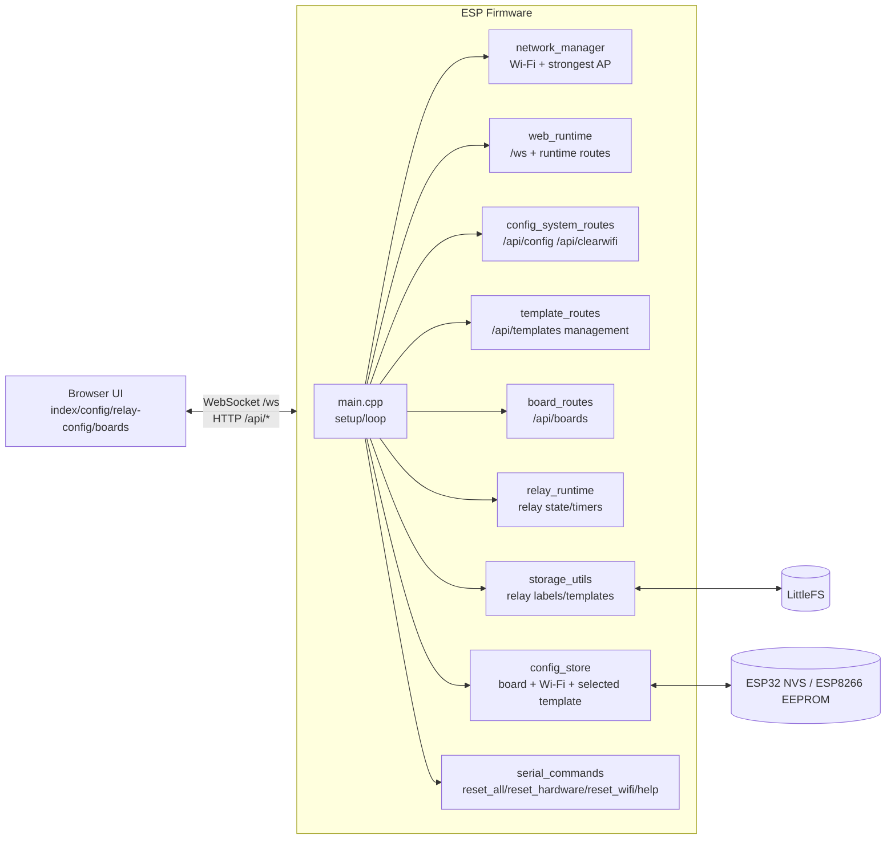
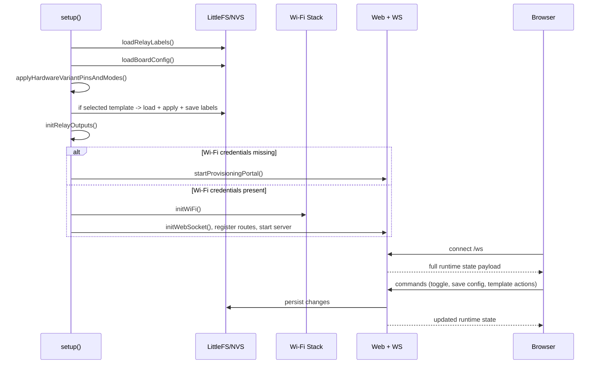

# ESP Relay WebSockets Controller

Firmware + web UI for ESP32/ESP8266 relay controllers with:
- Real-time WebSocket control
- Per-relay behavior modes (latched/interlocked/pulsed)
- Board hardware variants (8-relay and 16-relay)
- Template-based relay configuration management
- Wi-Fi provisioning, static/DHCP config, strongest-SSID tools

## AI Collaboration And Standards

- Project-wide AI instructions: `.github/copilot-instructions.md`
- Agent standards: `AGENTS.md`
- Scoped workflow instructions: `.github/instructions/firmware-workflow.instructions.md`
- AI runbook (updates, tests, device interaction, root-cause workflow): `docs/AI_COLLABORATION_RUNBOOK.md`
- Claude project instructions: `CLAUDE.md`
- Claude workflow command templates: `.claude/commands/`
- Claude usage guide: `.claude/README.md`
- Copilot prompt templates: `.github/prompts/`
- Cursor rules: `.cursor/rules/project-standards.mdc`
- Aider config: `.aider.conf.yml`
- Continue guide: `.continue/README.md`
- Cline instructions: `CLINE.md`
- OpenHands guide: `.openhands/README.md`
- Cross-engine matrix: `docs/AI_ENGINE_MATRIX.md`
- One-command AI workflow scripts: `scripts/ai/README.md`

## Architecture

### High-Level System Diagram


### Boot and Runtime Flow


## System Documentation

### Core Subsystems

- Runtime and scheduling:
  - `src/main.cpp` controls startup, loop timing, restart scheduling, OTA, serial processing. Calls `dispatchPendingNotifications()` each loop iteration to drain deferred WebSocket sends.
- Networking:
  - `src/network_manager.cpp` handles DHCP/static IP startup, strongest matching SSID connect, and rescan flow.
- Realtime state transport:
  - `src/web_runtime.cpp` publishes full system/relay state over `/ws` and serves runtime HTTP endpoints.
- Config APIs:
  - `src/config_system_routes.cpp` handles board config, Wi-Fi clear, label save.
- Template management APIs:
  - `src/template_routes.cpp` handles list/create/upload/set-active/rename/delete template operations and diagnostics.
- Board hardware APIs:
  - `src/board_routes.cpp` reads/writes hardware definition JSON in `/boards`.
- Relay behaviors:
  - `src/relay_runtime.cpp` enforces latched/interlocked/pulsed logic and timers.
- Persistence:
  - `src/config_store.cpp` persists board config, Wi-Fi creds, startup behavior, selected template (`ESP32 -> NVS`, `ESP8266 -> EEPROM with CRC`).
  - `src/storage_utils.cpp` persists relay labels/modes and loads template data.

### Web UI Pages

- Main runtime page: `/` (`data/index.html`, `data/script.js`)
- Board config page: `/config.html` (`data/config.html`, `data/config.js`)
- Relay config + templates: `/relay-config.html` (`data/relay-config.html`, `data/relay-config.js`)
- Board hardware editor: `/boards.html` (`data/boards.html`, `data/boards.js`)
- Theme picker (colour scheme + button style): `/theme.html` (`data/theme.html`, `data/theme.js`)

### Theming

The web UI theme has two independent dimensions, both selected on `/theme.html` with live preview:

- **Colour scheme** — light/dark palettes defined in `data/color-schemes.json`, applied everywhere as CSS variables (`--clr-bg`, `--clr-primary`, `--clr-accent`, `--clr-active`, text/banner/button-text colours).
- **Button style** — one of `classic`, `soft`, `glass`, `outline`, `tactile`, `pill`, defined in `data/style.css` and applied via a `data-btnstyle` attribute on `<html>`. Every style derives its colours from the active scheme and has distinct default, hover, pressed, on, last-toggled, and disabled states. `classic` is the original flat look and is the default.

Persistence and application:
- `GET /api/theme` returns `{"h":"<9 comma-separated hex colours>","s":"<style id>"}`.
- `POST /api/theme` accepts form fields `h` (required, 7 or 9 hex colours) and `s` (optional, validated against the known style ids).
- Stored in board config (`themeH`/`themeS`: ESP32 NVS, ESP8266 EEPROM JSON).
- `data/theme-apply.js` runs in every page `<head>`, applying the theme from `localStorage` (`rly_theme`, `rly_btnstyle`) instantly and falling back to `/api/theme` on first load.

### Template System (Current Behavior)

Templates contain full relay configuration per channel:
- `on`, `off`
- `mode` (`latched`, `interlocked`, `pulsed`)
- `group`
- `pulseTimeout` (`0` when mode is not `pulsed`, otherwise `1-30` seconds)

Available operations:
- List templates: `GET /api/templates`
- Template diagnostics: `GET /api/templates/diagnostics`
- Save template from current editor: `POST /api/templates` (default save action)
- Upload template JSON: `POST /api/templates` with `action=upload`
- Apply/select template (and persist for reboot): `POST /api/templates` with `action=setactive` (legacy alias: `action=select`)
- Rename template: `POST /api/templates` with `action=rename`
- Delete template: `POST /api/templates` with `action=delete` (legacy route also available: `DELETE /api/templates?filename=...`)
- Download template: static file from `/templates/<filename>.json`

Selected template persistence:
- Stored in board config (`selectedRelayTemplateFilename`)
- Reapplied during startup before normal runtime service starts

Variant safety:
- Active board selection is the single source of truth for CPU and relay count.
- Board selection is restricted to board definitions matching the running MCU (ESP8266 vs ESP32).
- Template list/apply/upload are restricted to templates matching the active board relay count.
- When the active board relay count changes, an incompatible selected template is replaced with the matching default template.
- At startup, if a persisted selected template no longer matches the active board relay count, it is reset to the matching default template before runtime template application.

Unconfigured board defaults:
- Startup delay disabled (`doDelay=false`, `startupDelaySeconds=0`)
- DHCP enabled (`useStaticIp=false`)
- Connect strongest AP on startup enabled (`connectStrongestOnStartup=true`)

### Platform-Specific WebSocket Behavior

**ESP8266 — interrupt-safe deferred dispatch**

On ESP8266, `ESPAsyncWebServer` WebSocket callbacks run in `ctx: sys` (lwIP interrupt context). Calling `ws.textAll()` from that context invokes `new AsyncWebSocketMessageBuffer()` → `malloc()`, which is not reentrant on ESP8266. This corrupts the heap allocator and causes Exception 9, WDT resets, and crashes in unrelated subsystems (e.g., mDNS).

All WebSocket notification calls (`notifyClients`, `notifyRelayStates`, `notifyRelayState`, `notifyClient`) are deferred to `loop()` via `volatile bool` pending flags. `dispatchPendingNotifications()` in `loop()` drains these flags. Hardware relay writes (`writeRelaysToShiftRegister`) remain synchronous in the interrupt handler for immediate physical response. JSON payload buffers use `static char[]` (BSS) instead of `String` to eliminate realloc from interrupt context.

**Rule:** Never call `ws.textAll()`, `ws.text()`, or `client->text()` directly from a WebSocket event callback on ESP8266. Set a pending flag and dispatch from `loop()`.

**ESP32 — TCP_NODELAY for low-latency sends**

On ESP32, callbacks run in a FreeRTOS task where `malloc` is safe, so notifications are called directly. WiFi modem sleep is disabled (`esp_wifi_set_ps(WIFI_PS_NONE)` in `initWiFi()`). `TCP_NODELAY` is set per client at `WS_EVT_CONNECT` via `client->client()->setNoDelay(true)` to disable Nagle's algorithm — without it, small relay-state messages (~50 bytes) are held by lwIP until an ACK returns or the buffer fills, adding 40–200 ms per send.

## User Manual

### 1. First Boot / Provisioning

1. Flash firmware + filesystem.
2. If Wi-Fi is not configured, device enters provisioning mode.
3. Configure Wi-Fi via provisioning page or serial command `reset_wifi`.

### 2. Configure Board

1. Open `/config.html`.
2. Set board name, startup behavior, and Wi-Fi/network mode.
3. Relay count and MCU type are read-only on this page and are derived from the active board selection.
4. Save to apply. Some changes schedule restart.

### 3. Configure Relays

1. Open `/relay-config.html`.
2. Edit labels and relay modes.
3. Save to apply live.

### 4. Manage Templates

On `/relay-config.html` Template Management:
- Load: preview/apply values into editor fields
- Save Template: save current editor as a template file
- Upload: import template JSON file
- Download: export selected template JSON
- Remove: delete selected template
- Apply Template: apply selected template to relays now and set as boot default

### 5. Manage Hardware Definition

1. Open `/boards.html`.
2. Select a board definition that matches the running MCU and set it active.
3. Edit board JSON fields as needed and save.

## Setup and Build

## Prerequisites

- VS Code + PlatformIO extension (recommended)
- Or PlatformIO Core CLI (`platformio`)
- USB serial access to board (example uses `COM40` in `platformio.ini`)

## PlatformIO Environments

Defined in `platformio.ini`:
- `esp8266_serial`
- `esp8266_ota`
- `esp32_serial`
- `esp32_ota`

## Build Commands

- Build ESP32 serial:
```bash
platformio run -e esp32_serial
```

- Build ESP8266 serial:
```bash
platformio run -e esp8266_serial
```

## One-Command Validation (Preferred)

- Full functional validation:
```powershell
pwsh ./scripts/ai/Run-AI-FullValidation.ps1 -Esp8266 <ESP8266_IP> -Esp32 <ESP32_IP> -Mode Full
```

- Release gate (build + optional updates + full + soak):
```powershell
pwsh ./scripts/ai/Run-AI-ReleaseGate.ps1 -Esp8266 <ESP8266_IP> -Esp32 <ESP32_IP> -UploadFirmware -UploadFilesystem
```

## Flash Commands

- ESP32 serial firmware:
```bash
platformio run -e esp32_serial -t upload
```

- ESP32 filesystem:
```bash
platformio run -e esp32_serial -t uploadfs
```

- ESP32 combined firmware + filesystem (custom target):
```bash
platformio run -e esp32_serial -t upload_all
```

- ESP8266 serial firmware:
```bash
platformio run -e esp8266_serial -t upload
```

- ESP8266 filesystem:
```bash
platformio run -e esp8266_serial -t uploadfs
```

- OTA examples:
```bash
platformio run -e esp32_ota -t upload
platformio run -e esp8266_ota -t upload
```

## Serial Monitor

```bash
platformio device monitor -b 115200
```

## Hardware Variant Setup and Customization

Variant selection is runtime-configured (`8relay` or `16relay`), then mapped to board files:
- `/boards/esp32-8relay.json`
- `/boards/esp32-16relay.json`
- `/boards/esp8266-8relay.json`
- `/boards/esp8266-16relay.json`

Customize either by:
- UI editor at `/boards.html` (recommended)
- Editing files under `data/boards/*.json` and re-uploading filesystem

Hardware file controls:
- `name`, `cpu`, `relayCount`, `ledPin`
- `outputType` (`gpio` or `shiftregister`)
- Per-relay pins (`relays[]`) or shift-register pins (`shiftRegister`)

## Serial Command Reference

Implemented in `src/serial_commands.cpp`. Help is printed automatically at startup.

- `reset_all`
  - Asks for a single confirmation.
  - Runs the hardware setup wizard, then clears Wi-Fi credentials and runs the Wi-Fi wizard.
  - Schedules restart on completion (even if Wi-Fi wizard is skipped/cancelled — hardware config is preserved).

- `reset_hardware`
  - Asks for confirmation.
  - Runs the hardware setup wizard: prompts for relay count (8 or 16), sets the platform-appropriate board file, saves config.
  - On success, schedules restart.

- `reset_wifi`
  - Asks for confirmation.
  - Clears saved Wi-Fi credentials.
  - Starts serial Wi-Fi provisioning wizard.
  - On success, schedules restart.

- `wifi_rescan`
  - Triggers Wi-Fi scan and reconnect attempt to the strongest AP matching the configured SSID.
  - Uses the same strongest-SSID logic as the web rescan action.

- `wifi_strongest`
  - Alias of `wifi_rescan`.

- `help`
  - Prints available commands.

Serial wizard behavior (`src/serial_provision.cpp`):

Hardware wizard:
- Shows platform (ESP8266 / ESP32)
- Prompts for relay count (8 or 16)
- Sets `hardwareVariant` and `activeBoardHardwareFilename` to the platform-appropriate default board file
- Saves to config store

Wi-Fi wizard:
- Scans SSIDs
- Lets user choose by index or type SSID directly
- Prompts for password
- Saves credentials to config store

## Notes and Troubleshooting

- If template upload/apply fails, verify JSON format includes `labels` and valid relay count.
- If UI appears stale after updates, hard-refresh browser and verify `uploadfs` completed.
- If device is unreachable after network change, reconnect via serial and use `reset_wifi`.
- Child pages auto-redirect to main page when device restarts and comes back online.
- After a reboot is detected through WebSocket state (`bootSessionId` change), clients force-return to `/?refresh=...` to ensure a fresh main-page load.
- `/netinfo` now includes Wi-Fi and hardware summary fields (`wifiConnected`, SSID/status, `mcuType`, `hardwareVariant`, `relayCount`, board hardware name/file) so the configuration page can render read-only status even if WebSocket state is delayed.
